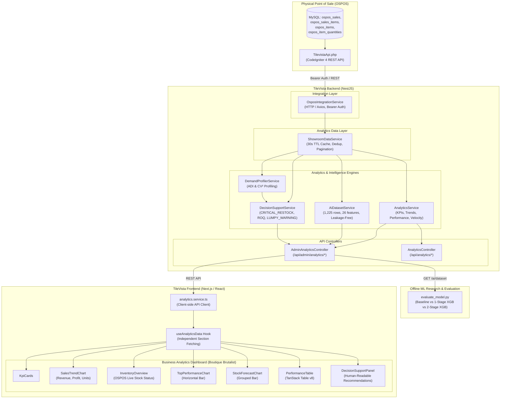

# Technical Report: TileVista Analytics and Decision Support Implementation Evidence

> **Document Type:** Technical System Implementation & Evaluation Evidence  
> **System:** TileVista 3D Virtual Showroom & Management System  
> **Subsystem:** Analytics, Demand Profiling, Forecasting, and Decision Support Engine  
> **Status:** Fully Implemented and Functionally Validated, Frozen Evaluation  
> **Repository Base:** `d:\Documents\TileVista` | `c:\xampp\htdocs\ospos`  
> **Date:** September 2026  

---

## 1. Analytics and Decision Support Overview

The TileVista Analytics and Decision Support subsystem provides a showroom-oriented, end-to-end intelligence platform for tile and sanitaryware retail. It bridges physical showroom transactions recorded in Open Source Point Of Sale (OSPOS) with online showroom operations, extracts historical demand patterns, profiles product consumption behaviors using canonical classification frameworks, evaluates machine learning forecasting models against empirical baselines, and generates actionable, explainable inventory replenishment directives.

### 1.1 End-to-End Architectural Pipeline

The complete data pipeline moves sequentially through seven operational stages:
1. **OSPOS Point of Sale (Physical Layer):** Records showroom sales, customer orders, returns, and physical inventory balances in MySQL.
2. **TileVista Backend Integration Layer:** Connects to OSPOS via authenticated HTTP REST endpoints (`TilevistaApi`), normalizing raw transactional rows into strongly-typed domain primitives.
3. **Analytics Data Layer (`ShowroomDataService`):** Single authoritative data provider handling pagination traversal, 30-second TTL caching, request deduplication, multi-item transaction reconstruction, and data quality reporting.
4. **Descriptive Analytics Engine (`AnalyticsService`):** Computes executive KPIs, daily/weekly/monthly revenue and profit trends, intra-category sales velocity rankings, and inventory valuations.
5. **Demand Profiling Service (`DemandProfilerService`):** Implements the Syntetos-Boylan demand categorization matrix, measuring Average Demand Interval (ADI) and squared Coefficient of Variation ($CV^2$) over a 181-day canonical window.
6. **AI Dataset & Machine Learning Evaluation (`AiDatasetService` & `evaluate_model.py`):** Generates point-in-time, leak-free feature matrices across multiple rolling forecast origins, evaluating Single-Stage and Two-Stage XGBoost architectures against a rolling 30-day baseline.
7. **Decision Support Engine (`DecisionSupportService`):** Applies multi-condition inventory heuristics combining current physical stock, OSPOS reorder levels, 30-day forecasted demand, and demand classifications to issue prioritized replenishment, clearance, and safety buffer directives.
8. **Frontend Analytics Console (`AnalyticsFeature`):** Displays executive KPI cards, interactive sales and profit trends, stock vs. forecast comparisons, top-grossing products, a high-density performance table, and a human-readable decision support checklist.

### 1.2 System Architecture Diagram



### 1.3 Exact Codebase File Mapping

| Architectural Layer | File Path | Class / Module Name | Primary Responsibility |
|---|---|---|---|
| **OSPOS Integration API** | `c:\xampp\htdocs\ospos\app\Controllers\TilevistaApi.php` | `TilevistaApi` | Read-only CodeIgniter 4 REST controller exposing items, categories, stock, and sales. |
| **Backend OSPOS Gateway** | `backend/src/modules/integrations/ospos/ospos.service.ts` | `OsposIntegrationService` | NestJS HTTP service managing token authentication, timeouts, and fallback handling. |
| **Authoritative Data Layer** | `backend/src/modules/analytics/showroom/showroom-data.service.ts` | `ShowroomDataService` | Authoritative provider for pagination traversal, caching, normalization, and diagnostics. |
| **Descriptive Analytics Service** | `backend/src/modules/analytics/analytics.service.ts` | `AnalyticsService` | Computes revenue, profit, velocity classification, trends, and category performance. |
| **Demand Profiler Service** | `backend/src/modules/analytics/decision-support/demand-profiler.service.ts` | `DemandProfilerService` | Calculates ADI and $CV^2$ over canonical 181 days; categorizes demand patterns. |
| **AI Dataset Generator** | `backend/src/modules/analytics/ai/ai-dataset.service.ts` | `AiDatasetService` | Builds point-in-time ML feature matrix (1,225 rows, 26 features) with zero data leakage. |
| **Decision Support Service** | `backend/src/modules/analytics/decision-support/decision-support.service.ts` | `DecisionSupportService` | Evaluates multi-attribute inventory rules (reorder levels, forecast, demand class) to output recommendations. |
| **Analytics Controllers** | `backend/src/modules/analytics/admin-analytics.controller.ts`<br>`backend/src/modules/analytics/analytics.controller.ts` | `AdminAnalyticsController`<br>`AnalyticsController` | Exposes authenticated REST endpoints under `/api/admin/analytics/*` and `/api/analytics/*`. |
| **Model Evaluation Script** | `ml/evaluate_model.py` | Standalone Python Script | Evaluates Baseline, Single-Stage XGBoost, and Two-Stage XGBoost models across test origins. |
| **Frontend API Gateway** | `frontend/src/services/analytics.service.ts` | `analyticsService` | Client-side fetch wrapper handling authorization headers and API data mapping. |
| **Frontend React Hook** | `frontend/src/features/analytics/hooks/useAnalyticsData.ts` | `useAnalyticsData` | Independent section data fetching, loading skeletons, and localized error state management. |
| **Frontend Page Root** | `frontend/src/features/analytics/index.tsx` | `AnalyticsFeature` / `AnalyticsInner` | Top-level dashboard view wrapped in Suspense with URL search param synchronization. |
| **Dashboard UI Components** | `frontend/src/features/analytics/components/*` | `KpiCards`, `SalesTrendChart`, `InventoryOverview`, `TopPerformanceChart`, `StockForecastChart`, `PerformanceTable`, `DecisionSupportPanel` | Modular React components rendering charts, tables, cards, and actionable decision tools. |

---

## 2. OSPOS Analytics Data Integration

### 2.1 External Endpoints and HTTP Contracts

The OSPOS integration is implemented in `TilevistaApi.php` (OSPOS) and consumed by `OsposIntegrationService` (TileVista backend). All communication uses HTTP/1.1 over REST:

| Endpoint | HTTP Method | Parameters | Return Structure |
|---|---|---|---|
| `/api/tilevista/items` | `GET` | None | Array of items containing `item_id`, `name`, `category`, `category_id`, `sku`, `description`, `price`, `quantity`, `reorder_level`, and EAV `attributes` (`Brand`, `Color`, `Material`). |
| `/api/tilevista/stock/{item_id}` | `GET` | `item_id` (URL path) | `{ item_id: number, quantity_available: number }` reflecting stock at Location 1 (Weerawila Showroom). |
| `/api/tilevista/categories` | `GET` | None | Array of parent categories containing nested `subcategories` arrays. |
| `/api/tilevista/sales` | `GET` | `start_date` (YYYY-MM-DD)<br>`end_date` (YYYY-MM-DD)<br>`page` (int, default 1)<br>`limit` (int, default 50, max 200)<br>`location_id` (int, default 1)<br>`sale_type` (int, optional) | Paginated object: `{ data: OsposSaleItem[], pagination: { page, limit, total, totalPages }, summary: { totalRevenue, totalTax, totalTransactions, dateRange } }`. |

### 2.2 Authentication and Security

* **Authentication Protocol:** HTTP Bearer Token.
* **Header:** `Authorization: Bearer <token>`.
* **Validation Mechanism:** `TilevistaApi::checkAuth()` verifies incoming tokens against the server environment variable `OSPOS_TILEVISTA_TOKEN` defined in OSPOS's `.env`.
* **Failure Response:** Returns HTTP 401 Unauthorized (`{"error": "Unauthorized"}`) if missing or mismatched.

### 2.3 Relevant Database Tables in OSPOS

The OSPOS database (`ospos`) maintains relational integrity across the following tables utilized by the integration:
* `ospos_items`: Catalog items containing `item_id`, `name`, `category_id`, `item_number` (SKU), `unit_price`, `cost_price`, `reorder_level`, and `deleted` flag.
* `ospos_item_quantities`: Location-specific stock containing `item_id`, `location_id`, and high-precision decimal `quantity`.
* `ospos_sales`: Transaction headers containing `sale_id`, `sale_time`, `customer_id`, `employee_id`, `comment`, `invoice_number`, `sale_status`, and `sale_type`.
* `ospos_sales_items`: Transaction line items containing `sale_id`, `item_id`, `line`, `quantity_purchased`, `item_cost_price`, `item_unit_price`, `discount`, `discount_type`, and `item_location`.
* `ospos_sales_items_taxes`: Line-level tax records containing `sale_id`, `item_id`, `line`, and `item_tax_amount`.
* `ospos_attribute_definitions`, `ospos_attribute_values`, `ospos_attribute_links`: Entity-Attribute-Value (EAV) system storing product attributes (`Brand`, `Color`, `Material`).
* `ospos_categories`, `ospos_subcategories`: Two-tier taxonomy storage.

### 2.4 Transaction and Status Filtering Rules

1. **Completed Sales Filter:** The SQL query in `TilevistaApi.php` explicitly applies `s.sale_status = 0`. In OSPOS, status 0 denotes finalized/settled sales. Incomplete, suspended, or cancelled transactions are strictly excluded from analytics.
2. **Location Filtering:** Every line item query joins on `si.item_location = 1` and `iq.location_id = 1`, restricting analytics strictly to the Weerawila Showroom outlet.
3. **Transaction Types:** `sale_type` maps to OSPOS transaction modes:
   * `0`: Standard POS Sale
   * `1`: Commercial Invoice
   * `2`: Work Order
   * `3`: Quotation
   * `4`: Customer Return
4. **Returns Recognition:** Items with `quantity_purchased < 0` represent customer returns. They are preserved in the result set to allow accurate net revenue and net volume calculations.
5. **OSPOS Discount Expression:** Line total revenue is calculated in SQL using the confirmed OSPOS discount formula:
   ```sql
   CASE WHEN si.discount_type = 0
        THEN si.quantity_purchased * si.item_unit_price
             - ROUND(si.quantity_purchased * si.item_unit_price * si.discount / 100, 2)
        ELSE si.quantity_purchased * (si.item_unit_price - si.discount)
   END
   ```

### 2.5 Single Source of Truth (SSOT) Confirmation

* **Physical Inventory & Sales SSOT:** **OSPOS is the sole, authoritative source of truth** for all physical stock quantities, item cost prices, unit selling prices, reorder levels, and completed POS transactions.
* **TileVista Read-Only Guarantee:** `TilevistaApi.php` is strictly read-only. TileVista never executes `UPDATE`, `INSERT`, or `DELETE` statements against OSPOS inventory or sales tables during analytics operations.

---

## 3. ShowroomDataService (Authoritative Data Layer)

The `ShowroomDataService` class (`backend/src/modules/analytics/showroom/showroom-data.service.ts`) acts as the centralized data aggregation and normalization provider for the entire analytics module.

### 3.1 Class Architecture & Lifecycle

* **Class Name:** `ShowroomDataService`
* **Dependencies Injected:** `OsposIntegrationService` (OSPOS HTTP client), `PrismaService` (TileVista local database access).
* **Caching Strategy:** Maintains an in-memory cache with a 30-second Time-To-Live (`CACHE_TTL_MS = 30000`):
  * `salesCache`: `Map<string, CacheEntry<OsposSaleItem[]>>` indexed by compound key `${startDate}_${endDate}_${locationId}`.
  * `inventoryCache`: `CacheEntry<InventorySnapshot[]> | null`.
* **Request Deduplication:** Consecutive or concurrent calls within 30 seconds for the same date range and location return the in-memory array, preventing redundant multi-page HTTP round trips.

### 3.2 Key Methods and Input/Output Contracts

#### `fetchAllRawSales(startDate?, endDate?, locationId?): Promise<OsposSaleItem[]>`
Traverses OSPOS pagination automatically using a `do...while` loop with `pageSize = 200` until `currentPage > totalPages`. Aggregates all line items across pages into a single flat array.

#### `getNormalizedSaleItems(startDate?, endDate?, locationId?): Promise<SaleItem[]>`
Transforms raw OSPOS records into typed `SaleItem` domain entities. Explicitly calculates:
* `grossRevenue`: Raw line total from OSPOS (`raw.line_total`).
* `taxAmount`: Raw tax amount (`raw.tax_amount`).
* `netRevenue`: $\text{grossRevenue} - \text{taxAmount}$.
* `cogs`: $\text{quantityPurchased} \times \text{itemCostPrice}$.
* `grossProfit`: $\text{netRevenue} - \text{cogs}$.
* `isReturn`: Boolean flag (`quantityPurchased < 0`).

#### `getNormalizedSales(startDate?, endDate?, locationId?): Promise<Sale[]>`
Groups normalized sale line items by `saleId` to reconstruct transaction headers. Sums transaction-level gross revenue, net revenue, tax, units, and line counts.

#### `getProductSalesSummaries(startDate?, endDate?, locationId?): Promise<ProductSalesSummary[]>`
Aggregates sales performance per catalog product over the requested time window:
* Separates positive sales (`unitsSold`) from negative return lines (`unitsReturned`).
* Computes `netUnitsSold = unitsSold - unitsReturned`.
* Computes `grossProfit = netRevenue - totalCost`.
* Computes `profitMarginPercent = (grossProfit / netRevenue) * 100` (guarded against zero division).
* Computes `averageSellingPrice = priceSum / priceCount`.
* Identifies `firstSaleDate` and `lastSaleDate` bounds.
* Returns items sorted by `grossRevenue` descending.

#### `getInventorySnapshots(): Promise<InventorySnapshot[]>`
Extracts live inventory levels for all products and implements a **Three-Tier Threshold Priority** to determine stock health:
1. **Tier 1 (Primary):** OSPOS `reorder_level` from `ospos_items`. If $> 0$, this is selected as `effectiveThreshold` with source `'ospos_reorder_level'`.
2. **Tier 2 (Secondary):** TileVista local `stock_thresholds` database table linked via `ospos_item_id`. If defined, selected as `effectiveThreshold` with source `'tilevista_threshold'`.
3. **Tier 3 (Fallback):** System-wide default fallback (`config.lowStockThreshold = 10`) with source `'global_fallback'`.

**Stock Health Classification:**
* `OUT_OF_STOCK`: $\text{currentStock} \le 0$.
* `LOW_STOCK`: $\text{currentStock} \le \text{effectiveThreshold}$ (and $> 0$).
* `HEALTHY`: $\text{currentStock} > \text{effectiveThreshold}$.

#### `getTimeSeriesTrends(startDate?, endDate?, granularity?, locationId?): Promise<SalesTrendPoint[]>`
Buckets line items into temporal intervals:
* `'day'`: Format `YYYY-MM-DD`.
* `'week'`: Format `YYYY-Www` (ISO week number calculated using Thursday-aligned week 1).
* `'month'`: Format `YYYY-MM`.

#### `getDataQualityReport(startDate?, endDate?, locationId?): Promise<DataQualityMetadata>`
Scans raw line items and generates data provenance metadata:
* `totalSalesCount`: Number of unique transaction IDs.
* `totalLineItemsCount`: Total item rows.
* `missingBrandCount`: Number of items missing Brand EAV attributes.
* `missingCategoryCount`: Items without valid category assignment.
* `returnedUnitsCount` & `returnedLinesCount`: Return frequency metrics.
* `isMockData`: Boolean flag set to `true` if any `sale_id >= 10000`.

#### `getDataLayerSummary(startDate?, endDate?): Promise<DataLayerSummaryDto>`
Diagnostic verification method answering the 8 core showroom analytics questions (`whatWasSold`, `whenWasItSold`, `howMuchWasSold`, `whichProduct`, `whichCategory`, `whichBrand`, `whatIsCurrentStock`, `whatIsReorderLevel`).

---

## 4. Descriptive Analytics Engine

Descriptive analytics endpoints are served by `AnalyticsService` (`backend/src/modules/analytics/analytics.service.ts`) and exposed via `AdminAnalyticsController` (`backend/src/modules/analytics/admin-analytics.controller.ts`).

### 4.1 Endpoints and Route Contracts

```text
Endpoint: /api/admin/analytics/kpis
HTTP Method: GET
Guards: JwtAuthGuard
Service: AnalyticsService.getOverviewKPIs(startDate, endDate)
Main Purpose: Executive summary metrics for the selected period.
Important Response Fields:
  - totalGrossRevenue: number (Sum of line totals before tax)
  - totalNetRevenue: number (Gross revenue minus total taxes)
  - netUnitsSold: number (Positive units sold minus returned units)
  - totalTransactions: number (Unique completed sale headers)
  - averageTransactionValue: number (Net revenue divided by total transactions)
  - totalProfit: number (Net revenue minus COGS)

Endpoint: /api/admin/analytics/trends
HTTP Method: GET
Guards: JwtAuthGuard
Service: AnalyticsService.getSalesTrends(startDate, endDate, interval)
Main Purpose: Time-series revenue, profit, and volume aggregation.
Query Parameters: startDate, endDate, interval (DAILY | WEEKLY | MONTHLY)
Important Response Fields:
  - interval: string
  - data: Array of { date, grossRevenue, netRevenue, netUnitsSold, profit }

Endpoint: /api/admin/analytics/performance
HTTP Method: GET
Guards: JwtAuthGuard
Service: AnalyticsService.getPerformanceMetrics(startDate, endDate, groupBy)
Main Purpose: Multi-dimensional revenue and profit ranking.
Query Parameters: startDate, endDate, groupBy (PRODUCT | BRAND | CATEGORY)
Important Response Fields:
  - groupBy: string
  - data: Array of { itemId, name, category, netRevenue, netUnitsSold, profit } sorted by netRevenue DESC

Endpoint: /api/admin/analytics/velocity
HTTP Method: GET
Guards: JwtAuthGuard
Service: AnalyticsService.getProductVelocityClassification(startDate, endDate)
Main Purpose: Relative demand velocity categorisation within product categories.
Important Response Fields:
  - analysisPeriodDays: number
  - data: Array of { productId, productName, category, brand, netUnitsSold, averageDailySales, classification }

Endpoint: /api/admin/analytics/inventory
HTTP Method: GET
Guards: JwtAuthGuard
Service: AnalyticsService.getInventoryAnalytics()
Main Purpose: Showroom physical inventory status and valuation.
Important Response Fields:
  - totalCurrentStock: number (Total units currently in showroom)
  - itemsAtOrBelowReorderLevel: number (Count of items needing restock)
  - outOfStockItems: number (Count of items with zero or negative stock)
  - totalStockValue: number (Sum of currentStock * unitPrice)
```

### 4.2 Exact Metric Calculations

All calculations in `AnalyticsService` are derived deterministically from normalized OSPOS line items:
* **Gross Revenue:** $\sum \text{item.grossRevenue}$
* **Net Revenue:** $\sum \text{item.grossRevenue} - \sum \text{item.taxAmount}$
* **Units Sold:** $\sum_{\text{qty} > 0} \text{item.quantityPurchased}$
* **Net Units Sold:** $\sum_{\text{qty} > 0} \text{item.quantityPurchased} - \sum_{\text{qty} < 0} |\text{item.quantityPurchased}|$
* **Total Transactions:** Count of unique completed `sale_id` instances where `sale_status = 0`.
* **Average Transaction Value (ATV):** $\frac{\text{totalNetRevenue}}{\text{totalTransactions}}$ (0 if transactions = 0).
* **Cost of Goods Sold (COGS):** $\sum (\text{item.quantityPurchased} \times \text{item.itemCostPrice})$
* **Profit (Gross Profit):** $\text{totalNetRevenue} - \text{totalCogs}$
* **Intra-Category Velocity Ranking:**
  1. Products are partitioned by `category`.
  2. Products within each category are sorted by `netUnitsSold` descending.
  3. Let $N$ be the item count in a category. $\text{top20Index} = \max(1, \lceil N \times 0.2 \rceil)$, $\text{bottom20Index} = \lfloor N \times 0.8 \rfloor$.
  4. Classification rules:
     * If $\text{netUnitsSold} \le 0 \implies \text{SLOW\_MOVING}$
     * Else if $\text{index} < \text{top20Index} \implies \text{FAST\_MOVING}$
     * Else if $\text{index} \ge \text{bottom20Index} \implies \text{SLOW\_MOVING}$
     * Else $\implies \text{NORMAL}$
  5. Average Daily Sales: $\frac{\text{netUnitsSold}}{\text{daysInPeriod}}$.

---

## 5. Returns Handling Architecture

Returns in OSPOS and TileVista represent genuine customer adjustments and are processed to maintain mathematical integrity across all accounting metrics:

1. **Identification of Returns:**
   * Line-level identification: Any line item where `quantity_purchased < 0` is flagged with `isReturn: true`.
   * Transaction-level identification: A sale header is flagged as a return transaction if all its constituent items are return lines or if `sale_type = 4`.
2. **Impact on Physical Units:**
   * Positive purchases add to `unitsSold`.
   * Negative returns add to `unitsReturned` as an absolute value: $|\text{quantityPurchased}|$.
   * Total net volume is strictly calculated as:
     $$\text{netUnitsSold} = \text{unitsSold} - \text{unitsReturned}$$
3. **Impact on Financial Metrics:**
   * When `quantity_purchased < 0`, the line revenue expression yields a negative monetary value:
     $$\text{grossRevenue} < 0 \quad\text{and}\quad \text{cogs} < 0$$
   * In `getOverviewKPIs()`, negative gross revenue and negative taxes reduce `totalGrossRevenue` and `totalTaxAmount`.
   * Consequently, `totalNetRevenue` and `totalProfit` are adjusted downwards by the exact value of the returned goods.
4. **Impact on Transaction Counts:**
   * Customer returns that were executed as standalone transactions in OSPOS have distinct `sale_id` headers. They are enumerated in transaction totals.
5. **Implementation Locations:**
   * Extraction & Line Normalization: `ShowroomDataService.getNormalizedSaleItems` (lines 118–123).
   * Product Aggregation: `ShowroomDataService.getProductSalesSummaries` (lines 260–265, 283–288).
   * KPI Aggregation: `AnalyticsService.getOverviewKPIs` (lines 182–186).
   * Trend Aggregation: `AnalyticsService.getSalesTrends` (lines 240–244).

---

## 6. Demand Profiling (Syntetos-Boylan Framework)

Demand profiling is executed by `DemandProfilerService` (`backend/src/modules/analytics/decision-support/demand-profiler.service.ts`).

### 6.1 Observation Series Construction

1. **Canonical Analysis Window:** Fixed 181-day evaluation period: `2026-02-21` to `2026-08-20` (`CANONICAL_DAYS = 181`).
2. **Daily Aggregation:** Slices normalized sale items within the window into daily buckets per product:
   $$\text{DailyNetUnits}(p, d) = \sum_{i \in \text{Sales}(p, d)} \text{quantityPurchased}_i$$
3. **Positive Demand Sifting:** Zero-demand days and net-negative return days are filtered out:
   $$\text{positiveDays}(p) = [\,\text{qty} \in \text{DailyNetUnits}(p) \mid \text{qty} > 0\,]$$
   $$N_{\text{sales}} = |\text{positiveDays}(p)|$$

### 6.2 Mathematical Formulas

* **Average Demand Interval (ADI):** Measures the average time (in days) between consecutive demand occurrences over the canonical period:
  $$\text{ADI} = \frac{\text{CANONICAL\_DAYS}}{N_{\text{sales}}} = \frac{181}{N_{\text{sales}}}$$
* **Sample Mean Demand ($\mu$):**
  $$\mu = \frac{1}{N_{\text{sales}}} \sum_{k=1}^{N_{\text{sales}}} \text{positiveDays}[k]$$
* **Sample Variance ($s^2$):** Uses Bessel's correction ($N_{\text{sales}} - 1$ denominator) when $N_{\text{sales}} > 1$:
  $$s^2 = \frac{1}{N_{\text{sales}} - 1} \sum_{k=1}^{N_{\text{sales}}} (\text{positiveDays}[k] - \mu)^2$$
* **Sample Standard Deviation ($s$):** $s = \sqrt{s^2}$
* **Squared Coefficient of Variation ($CV^2$):** Measures the relative dispersion of demand transaction sizes:
  $$CV^2 = \left( \frac{s}{\mu} \right)^2$$

### 6.3 Final Boundary Logic and Thresholds

The classification boundaries strictly implement the Syntetos-Boylan (2005) decision quadrant thresholds:
* **Cutoff Thresholds:** $\text{ADI}_{\text{cutoff}} = 1.32$, $CV^2_{\text{cutoff}} = 0.49$.

```text
Smooth:       ADI < 1.32  AND CV² < 0.49
Intermittent: ADI >= 1.32 AND CV² < 0.49
Erratic:      ADI < 1.32  AND CV² >= 0.49
Lumpy:        ADI >= 1.32 AND CV² >= 0.49
```

* **Zero Sales Guard:** If a product records zero positive sales days ($N_{\text{sales}} = 0$), the service sets $\text{ADI} = 181$, $CV^2 = 0$, and defaults to `'Smooth'`.
* **Sole Profiler Verification:** `DemandProfilerService` is the **only** backend service that calculates ADI/CV² and classifies demand patterns. No other NestJS service duplicates this calculation.

---

## 7. AI Forecasting Dataset Architecture

The ML training matrix is generated programmatically by `AiDatasetService` (`backend/src/modules/analytics/ai/ai-dataset.service.ts`) and served via `GET /api/admin/analytics/ai/dataset`.

### 7.1 Dataset Dimensions & Timeline Windows

* **Canonical Historical Window:** `2026-02-21` to `2026-08-20` (181 calendar days).
* **Warm-up Period:** 90 days (`WARMUP_DAYS = 90`), spanning `2026-02-21` to `2026-05-21`. This history is required to populate rolling 90-day features prior to the first forecast origin.
* **Forecast Horizon:** 30 days (`PREDICTION_HORIZON = 30`).
* **Forecast Origin ($T$):** The cutoff date. All features strictly evaluate historical data up to $T - 1$. The target strictly evaluates sales from $T$ to $T + 29$.
* **Training Period:** 22 daily origins from `2026-05-22` to `2026-06-12`.
* **Test Period:** 3 rolling origins spaced 5 days apart: `2026-07-12`, `2026-07-17`, and `2026-07-22`.
* **Product Catalog Size:** 49 distinct products.
* **Row Count Distribution:**
  * Training Rows: $22 \text{ origins} \times 49 \text{ products} = 1,078 \text{ rows}$.
  * Test Rows: $3 \text{ origins} \times 49 \text{ products} = 147 \text{ rows}$.
  * Total Dataset Size: $1,078 + 147 = 1,225 \text{ rows}$.

### 7.2 Feature Columns (26 Features)

The dataset contains 26 ML input features, categorized into six functional groups:

1. **Sales History Features:**
   * `sales_last_7d`: Net units sold over $[T - 7, T - 1]$.
   * `sales_last_30d`: Net units sold over $[T - 30, T - 1]$.
   * `sales_last_90d`: Net units sold over $[T - 90, T - 1]$.
2. **Demand Variability Features:**
   * `demand_std_30d`: Standard deviation of daily net units over $[T - 30, T - 1]$.
   * `zero_sales_days_last_30d`: Count of days with zero net sales over $[T - 30, T - 1]$.
3. **Lag Features:**
   * `sales_lag_1`: Net units sold on day $T - 1$.
   * `sales_lag_7`: Net units sold on day $T - 7$.
   * `sales_lag_14`: Net units sold on day $T - 14$.
   * `sales_lag_28`: Net units sold on day $T - 28$.
4. **Rolling Statistics:**
   * `rolling_mean_7d`: $\text{sales\_last\_7d} / 7$.
   * `rolling_mean_14d`: Average daily units over $[T - 14, T - 1]$.
   * `rolling_mean_30d`: $\text{sales\_last\_30d} / 30$.
   * `rolling_std_7d`: Standard deviation of daily units over $[T - 7, T - 1]$.
   * `rolling_std_14d`: Standard deviation of daily units over $[T - 14, T - 1]$.
5. **Historical Pricing & Promotion:**
   * `avg_selling_price_last_30d`: Mean unit selling price over $[T - 30, T - 1]$.
   * `avg_discount_depth_last_30d`: Mean discount percentage over $[T - 30, T - 1]$.
6. **Temporal Features:**
   * `month_of_year`: Month of origin date $T$ ($1 - 12$).
   * `week_of_year`: ISO week number of origin date $T$ ($1 - 53$).
   * `day_of_month`: Day of origin date $T$ ($1 - 31$).
   * `day_of_week`: Day of week of origin date $T$ ($0 = \text{Sunday}, 6 = \text{Saturday}$).
7. **Categorical Attributes (One-Hot Encoded):**
   * Dynamic category flags: `category_Accessories`, `category_Tiles`, `category_WashBasins`, `category_Water_Closets`.
   * Dynamic brand flags: `brand_Lanka`, `brand_Rocell`, `brand_Unbranded`.

### 7.3 Data Leakage Prevention Verification

Future data leakage is strictly prevented by four design constraints enforced in code (`validateNoLeakage`):
1. **Strict $T - 1$ Cutoff:** Historical features never inspect sales occurring on or after date $T$.
2. **Target Isolation:** Target variable `target_next_30d_units_sold` evaluates exclusively within $[T, T + 29]$.
3. **Temporal Split Gap:** The final training origin is `2026-06-12`. Its 30-day target window ends on `2026-07-11`. The earliest test origin is `2026-07-12`. Hence, the training target window never overlaps with the test origin date, completely eliminating target leakage.
4. **Programmatic Assertion:** The `validateNoLeakage()` function verifies that all rows satisfy origin $\ge$ warmup end, target end $\le$ canonical end, and train target end $<$ earliest test origin. The dataset passes with 0 violations.

---

## 8. Forecasting Models Architecture

The evaluation pipeline is implemented in Python (`ml/evaluate_model.py`) using `scikit-learn` and `xgboost`.

### 8.1 Model Formulations

#### 1. Historical Baseline Heuristic
Assumes demand in the next 30 days repeats the demand of the preceding 30 days:
$$\hat{y}_{\text{baseline}} = \max\left(0, \text{round}(\text{sales\_last\_30d})\right)$$

#### 2. Single-Stage XGBoost Regressor
Direct regression model trained on all 1,078 training instances using standard gradient boosted regression trees:
* **Algorithm:** `xgboost.XGBRegressor`
* **Hyperparameters:** `n_estimators=100`, `max_depth=5`, `learning_rate=0.1`, `random_state=42`, `objective='reg:squarederror'`.

#### 3. Two-Stage Hurdle / Classification-Regression Architecture
Designed specifically for intermittent demand containing a large proportion of zero-demand periods:
* **Stage 1 (Binary Classifier):** Predicts the probability that demand will occur in the next 30 days ($\text{target} > 0$):
  * **Algorithm:** `xgboost.XGBClassifier`
  * **Hyperparameters:** `n_estimators=100`, `max_depth=4`, `learning_rate=0.1`, `random_state=42`, `objective='binary:logistic'`, `eval_metric='logloss'`.
* **Stage 2 (Conditional Regressor):** Predicts demand volume given that demand is non-zero. Trained strictly on the 925 positive-demand training instances ($\text{target} > 0$):
  * **Algorithm:** `xgboost.XGBRegressor`
  * **Hyperparameters:** `n_estimators=100`, `max_depth=5`, `learning_rate=0.1`, `random_state=42`, `objective='reg:squarederror'`.
* **Combined Two-Stage Prediction:**
  $$\hat{y}_{\text{two-stage}} = \begin{cases} 
  0 & \text{if Stage 1 predicts } \hat{y}_{\text{bin}} = 0 \\ 
  \max\left(0, \text{round}(\hat{y}_{\text{reg}})\right) & \text{if Stage 1 predicts } \hat{y}_{\text{bin}} = 1 
  \end{cases}$$

---

## 9. Model Evaluation Results

The models were evaluated against the 147 test instances across the three chronological test origins. The results reported below represent the frozen evaluation metrics recorded from `ml/evaluate_model.py`.

### 9.1 Overall Performance Comparison (30-Day Horizon)

| Model Architecture | Mean Absolute Error (MAE) | Root Mean Squared Error (RMSE) | Weighted MAPE (WMAPE) |
|---|---|---|---|
| **Baseline (`sales_last_30d`)** | **10.1565** | **19.6619** | **0.3958** |
| **Two-Stage XGBoost** | 11.9116 | 24.7217 | 0.4642 |
| **Single-Stage XGBoost** | 11.9456 | 24.6298 | 0.4655 |

$$\text{WMAPE} = \frac{\sum |y_i - \hat{y}_i|}{\sum |y_i|}$$

### 9.2 Performance Broken Down by Chronological Forecast Origin

| Origin Date | Test Set Size | Metric | Baseline | Single-Stage XGB | Two-Stage XGB |
|---|---|---|---|---|---|
| **2026-07-12** | 49 Products | **MAE**<br>**RMSE**<br>**WMAPE** | **12.6735**<br>**24.7052**<br>**0.5124** | 12.8776<br>26.6010<br>0.5206 | 12.7143<br>26.4309<br>0.5140 |
| **2026-07-17** | 49 Products | **MAE**<br>**RMSE**<br>**WMAPE** | **9.0816**<br>**17.6502**<br>**0.3521** | 12.5510<br>25.5403<br>0.4866 | 12.4286<br>25.0782<br>0.4818 |
| **2026-07-22** | 49 Products | **MAE**<br>**RMSE**<br>**WMAPE** | **8.7143**<br>**15.4239**<br>**0.3295** | 10.4082<br>21.4467<br>0.3935 | 10.5918<br>22.4940<br>0.4005 |

### 9.3 Performance Broken Down by Demand Pattern Class

| Demand Class | Products (Test Rows) | Metric | Baseline | Single-Stage XGB | Two-Stage XGB |
|---|---|---|---|---|---|
| **Intermittent Demand** | 44 Products (132 rows) | **MAE**<br>**RMSE**<br>**WMAPE** | **9.8258**<br>**19.6042**<br>**0.4124** | 11.3409<br>24.7856<br>0.4760 | 11.1894<br>24.7483<br>0.4696 |
| **Lumpy Demand** | 5 Products (15 rows) | **MAE**<br>**RMSE**<br>**WMAPE** | **13.0667**<br>**20.1627**<br>**0.3126** | 17.2667<br>23.2135<br>0.4131 | 18.2667<br>24.4867<br>0.4370 |

### 9.4 Stage 1 Classification Metrics (Hurdle Classifier)

The Stage 1 XGBoost classifier achieved strong standalone classification metrics:
* **Accuracy:** 0.8776 ($87.76\%$)
* **Precision:** 0.9091 ($90.91\%$)
* **Recall:** 0.9402 ($94.02\%$)
* **F1-Score:** 0.9244
* **Confusion Matrix:**
  * True Negatives (Correct No-Demand): 19
  * False Positives (Predicted Demand, Actually Zero): 11
  * False Negatives (Predicted Zero, Actually Demand): 7
  * True Positives (Correct Demand): 110

### 9.5 Feature Importance Analysis

| Rank | Feature Name | Single-Stage Gain | Two-Stage Stage 2 Gain | Functional Interpretation |
|---|---|---|---|---|
| 1 | `sales_last_90d` | **0.7349** | **0.7218** | Dominant long-term demand volume indicator. |
| 2 | `demand_std_30d` | **0.1015** | **0.1072** | Variance and volatility indicator. |
| 3 | `category_Accessories` | 0.0468 | 0.0481 | Specific category volume scale. |
| 4 | `zero_sales_days_last_30d` | 0.0224 | 0.0225 | Demand intermittency frequency. |
| 5 | `avg_selling_price_last_30d` | 0.0166 | 0.0197 | High price suppresses transaction frequency. |
| 6 | `avg_discount_depth_last_30d`| 0.0121 | 0.0112 | Price sensitivity and promotional lift. |
| 7 | `category_Tiles` | 0.0109 | 0.0092 | Commodity tile purchasing behavior. |
| 8 | `rolling_std_14d` | 0.0107 | 0.0086 | Medium-term volatility. |
| 9 | `sales_last_30d` | 0.0083 | 0.0088 | Recent short-term volume. |
| 10| `brand_Lanka` | 0.0073 | 0.0080 | Brand preference coefficient. |

### 9.6 Method Selection and Engineering Rationale

* **Selected Operational Forecasting Method:** **Baseline Heuristic (`sales_last_30d`)**.
* **Empirical Justification:** The historical 30-day baseline achieved the lowest MAE (**10.1565**) across all origins and demand classes, outperforming both Single-Stage XGBoost (**11.9456**) and Two-Stage XGBoost (**11.9116**).
* **Scientific Interpretation:** In retail environments characterized by intermittent and lumpy demand with limited historical depth (6 months), tree-based gradient boosting models are susceptible to variance errors and over-smoothing on infrequent peaks. The simple, zero-parameter rolling baseline offers superior robustness, complete computational transparency, zero training overhead, and resistance to distributional drift.

---

## 10. Synthetic Dataset Characterization

### 10.1 Purpose and Scope

Due to privacy constraints and the absence of a multi-year historical database in the test showroom environment, a synthetic demand generator (`c:\xampp\htdocs\ospos\enhanced_seeder.php`) was executed to populate realistic showroom transactions into OSPOS.

### 10.2 Generation Parameters

* **Date Range:** `2026-02-21` to `2026-08-20` (181 calendar days).
* **Catalog Coverage:** Exactly 49 products spanning 4 primary categories: Tiles (18 items), Wash Basins (13 items), Water Closets (7 items), and Accessories (11 items).
* **Transaction Characteristics:**
  * Transaction IDs: Seeded strictly with `sale_id >= 10000` to distinguish synthetic records from real cashier entries.
  * Basket Sizes: Multi-item transactions grouping 1–5 line items per sale basket.
  * Transaction Modes: 70% standard POS, 20% Commercial Invoices, 10% Quotations.
  * Discount Mix: 65% zero discount, 25% percentage discounts (3%–15%), 10% fixed amount deductions.
  * Customer Returns: ~3% probability for items purchased within the previous 14 days, creating negative quantity lines (-1 to -2 units).
  * Outlier Events: 1% probability of bulk commercial purchases (3x–5x standard order quantity).
* **Demand Pattern Distribution:**
  * **44 Intermittent Demand Products** ($\text{ADI} \ge 1.32, CV^2 < 0.49$)
  * **5 Lumpy Demand Products** ($\text{ADI} \ge 1.32, CV^2 \ge 0.49$):
    1. *Vitosa Brown* ($CV^2 = 0.54$)
    2. *Mosaic - Glossy Glass - Oasis Blue* ($CV^2 = 0.57$)
    3. *Rain Shower* ($CV^2 = 0.74$)
    4. *Celeste Wall Hung Water Closet* ($CV^2 = 1.40$)
    5. *Exposed Thermostatic Shower Mixer - Chrome Finish* ($CV^2 = 1.28$)
  * **0 Smooth Demand Products**
  * **0 Erratic Demand Products**

### 10.3 Inventory Table Protection

The generator strictly executed `INSERT` operations into sales tables (`ospos_sales`, `ospos_sales_items`, `ospos_sales_items_taxes`). **It did not modify catalog or physical inventory tables:**
* `ospos_items` remained untouched (49 catalog products).
* `ospos_item_quantities` remained untouched (49 physical stock records).
* `ospos_inventory` remained untouched (61 audit logs).

---

## 11. Decision Support Engine Architecture

The `DecisionSupportService` (`backend/src/modules/analytics/decision-support/decision-support.service.ts`) executes deterministic inventory decision rules.

### 11.1 Inputs and Parameters

* `currentStock`: Live stock from OSPOS `ospos_item_quantities`.
* `effectiveThreshold`: Tier-1 reorder level from OSPOS `ospos_items.reorder_level`.
* `forecast30d`: 30-day baseline forecast derived from `sales_last_30d` over the window `2026-07-22` to `2026-08-20`.
* `demandClass`: Canonical demand class from `DemandProfilerService` (`'Intermittent'` or `'Lumpy'`).
* `coverageMultiplier`: Parameter controlling target coverage window (default = 1.0, covering 30 days).

### 11.2 Business Rules Specification

```text
Recommendation: CRITICAL_RESTOCK
Condition: (currentStock <= effectiveThreshold) OR (currentStock < forecast30d)
Inputs: currentStock, effectiveThreshold, forecast30d, coverageMultiplier
Priority: HIGH
Action: Reorder immediately. Recommended Order Qty (ROQ) = Math.max(0, (forecast30d * coverageMultiplier) - currentStock)

Recommendation: OVERSTOCK_CLEARANCE
Condition: (currentStock > (forecast30d * 6)) AND (currentStock > 50)
Inputs: currentStock, forecast30d
Priority: LOW
Action: Consider promotion/discount to reduce holding costs.

Recommendation: LUMPY_WARNING
Condition: (demandClass === 'Lumpy') AND (currentStock < (forecast30d * 2))
Inputs: currentStock, forecast30d, demandClass
Priority: MEDIUM
Action: Lumpy demand is prone to sudden spikes. Increase safety stock.

Recommendation: STABLE_INVENTORY
Condition: Default when no risk conditions are met
Inputs: currentStock, forecast30d
Priority: NONE
Action: Stock is healthy. No action needed.
```

---

## 12. Decision Support Triggers and Explainability

To provide complete transparency to showroom managers, every `CRITICAL_RESTOCK` recommendation evaluates a deterministic `trigger` property explaining the exact condition detected:

### 12.1 Trigger Definitions and Conditions

| Trigger Enum | Boolean Condition | Generated Explanation (`reason`) |
|---|---|---|
| `BELOW_REORDER_LEVEL` | `currentStock <= effectiveThreshold` AND `currentStock >= forecast30d` | *"Current stock is at or below the OSPOS reorder level."* |
| `FORECAST_EXCEEDS_STOCK`| `currentStock > effectiveThreshold` AND `currentStock < forecast30d` | *"Forecast demand exceeds the current available stock."* |
| `BOTH` | `currentStock <= effectiveThreshold` AND `currentStock < forecast30d` | *"Current stock is at or below the OSPOS reorder level and forecast demand exceeds current stock."* |
| `NONE` | Neither restock condition met (used for `OVERSTOCK`, `LUMPY`, `STABLE`) | Context-specific text (e.g. *"Current stock and forecasted demand are balanced."*) |

### 12.2 Real Implementation JSON Responses

#### Example 1: Critical Restock with BOTH Trigger
```json
{
  "productId": 42,
  "productName": "Rain Shower",
  "category": "Bathroom Accessories",
  "currentStock": 3,
  "forecast30d": 8,
  "demandClass": "Lumpy",
  "recommendationType": "CRITICAL_RESTOCK",
  "recommendedAction": "Reorder immediately. Recommended Order Qty (ROQ) = 5.",
  "reason": "Current stock is at or below the OSPOS reorder level and forecast demand exceeds current stock.",
  "priority": "HIGH",
  "trigger": "BOTH"
}
```

#### Example 2: Stable Inventory with NONE Trigger
```json
{
  "productId": 10,
  "productName": "Vitosa White",
  "category": "Floor Tiles",
  "currentStock": 200,
  "forecast30d": 15,
  "demandClass": "Intermittent",
  "recommendationType": "STABLE_INVENTORY",
  "recommendedAction": "Stock is healthy. No action needed.",
  "reason": "Current stock and forecasted demand are balanced.",
  "priority": "NONE",
  "trigger": "NONE"
}
```

---

## 13. Complete Backend API Route Directory

All routes require JWT authentication (`JwtAuthGuard`):

| Endpoint | Method | Purpose | Key Inputs | Main Output |
|---|---|---|---|---|
| `/api/admin/analytics/kpis` | `GET` | Computes revenue, profit, units sold, and transactions. | `startDate`, `endDate` | `KpiResponseDto` |
| `/api/admin/analytics/trends` | `GET` | Generates time-series line points. | `startDate`, `endDate`, `interval` | `TrendResponseDto` |
| `/api/admin/analytics/performance` | `GET` | Aggregates volume and revenue by dimension. | `startDate`, `endDate`, `groupBy` | `PerformanceResponseDto` |
| `/api/admin/analytics/velocity` | `GET` | Calculates product velocity tiers. | `startDate`, `endDate` | `VelocityResponseDto` |
| `/api/admin/analytics/inventory` | `GET` | Summarizes physical showroom stock and valuation. | None | `InventoryResponseDto` |
| `/api/admin/analytics/decision-support/recommendations` | `GET` | Evaluates decision rules and outputs restock actions. | `coverageMultiplier` (float, default 1) | `DecisionRecommendation[]` |
| `/api/admin/analytics/ai/dataset` | `GET` | Extracts ML feature matrix for model training. | None | `MlDatasetResponse` |
| `/api/analytics/data-layer/summary` | `GET` | Diagnostic check answering the 8 core analytics questions. | `startDate`, `endDate` | `DataLayerSummaryDto` |
| `/api/analytics/dashboard` | `GET` | Overview statistics combining online orders & OSPOS stock. | None | Dashboard stats payload |

---

## 14. Frontend Analytics Dashboard Implementation

The frontend is implemented in Next.js 14 and React 18 (`frontend/src/features/analytics/index.tsx`).

### 14.1 Component Hierarchy

```text
AnalyticsFeature (Root export wrapped in Suspense)
 └── AnalyticsInner
      ├── Page Header & Date Range Filter (From / To inputs with Calendar icon, Apply, Reset)
      ├── Active KPI Filter Banner (Drill-down indicator)
      ├── KpiCards (Revenue, Transactions, Units Sold, Profit)
      ├── SalesTrendChart (Interactive Line Chart with Metric Switcher: Revenue / Profit / Units)
      ├── InventoryOverview (Live Stock Metric Cards: Out of Stock, Below Reorder, Total Units, Value)
      ├── TopPerformanceChart (Horizontal Bar Chart with Metric Switcher: Revenue / Units)
      ├── StockForecastChart (Grouped Bar Chart: Current Stock vs. 30-Day Forecast)
      ├── PerformanceTable (TanStack Table v8: Sorting, Velocity Filtering, Pagination)
      └── DecisionSupportPanel (Actionable Cards, Status Dot, Search, Category Filter, Pagination)
```

### 14.2 Data Flow and Hook Architecture

* **Custom Hook:** `useAnalyticsData(dateRange)` (`src/features/analytics/hooks/useAnalyticsData.ts`).
* **Independent Loading:** Dispatches concurrent asynchronous calls for `kpis`, `trends`, `performance` + `velocity`, `inventory`, and `recommendations`.
* **State Isolation:** Each section maintains an independent `SectionStatus` (`{ isLoading: boolean, error: string | null }`). A failure in one chart does not interrupt or blank out other components.
* **Component-to-API Mapping:**
  * `KpiCards` $\leftarrow$ `analyticsService.getKpis()`
  * `SalesTrendChart` $\leftarrow$ `analyticsService.getTrends()`
  * `InventoryOverview` $\leftarrow$ `analyticsService.getInventory()`
  * `TopPerformanceChart` $\leftarrow$ `analyticsService.getPerformance()`
  * `StockForecastChart` $\leftarrow$ `analyticsService.getDecisionSupportRecommendations()`
  * `PerformanceTable` $\leftarrow$ `analyticsService.getPerformance()` and `analyticsService.getVelocity()`
  * `DecisionSupportPanel` $\leftarrow$ `analyticsService.getDecisionSupportRecommendations()`

---

## 15. UI/UX Design System (Boutique Brutalist Architecture)

The interface strictly conforms to the **TileVista Boutique-Brutalist** visual identity:
* **Background Canvas:** Neutral Off-White (`#F9F9F7`).
* **Surfaces:** Pure White (`#FFFFFF`).
* **Primary Typography:** Charcoal (`#1A1A1A`).
* **Secondary Typography:** Muted Sand / Taupe (`#A69485`).
* **Structural Borders:** 1px solid Gray (`#E5E5E3`).
* **Geometry:** Sharp rectangular corners (`rounded-none`).
* **Numerics:** Monospaced tabular alignment (`font-mono tabular-nums`).
* **Chart Metric Colors:**
  * **Revenue:** Muted Steel Blue (`#3E5C76`).
  * **Profit:** Muted Sage Green (`#6A7B58`).
  * **Units Sold:** Muted Bronze / Amber (`#8B5E2B`).

### 15.1 Human-Readable Technical Term Translations

To ensure accessibility for showroom administrative staff, internal technical enum codes are translated into natural English in the UI:

| Technical Backend Value | Frontend Display Label |
|---|---|
| `CRITICAL_RESTOCK` | **Critical Restock** |
| `OVERSTOCK_CLEARANCE` | **Overstock Alert** |
| `LUMPY_WARNING` | **Demand Spike Warning** |
| `STABLE_INVENTORY` | **Stable Inventory** |
| `FORECAST_EXCEEDS_STOCK` | **Forecast Demand Exceeds Stock** |
| `BELOW_REORDER_LEVEL` | **Stock At/Below Reorder Level** |
| `BOTH` | **Low Stock + Forecast Shortage** |
| `30D FORECAST` | **30-Day Forecast** |
| `DEMAND CLASS` | **Demand Pattern** |
| `TRIGGER` | **Why This Was Flagged** |
| `ROQ` | **Recommended Order** |
| `Intermittent` | **Occasional / Intermittent** |
| `Lumpy` | **Unpredictable / Lumpy** |
| `FAST_MOVING` | **Fast Moving (Top 20%)** |
| `SLOW_MOVING` | **Slow Moving (Bottom 20%)** |

---

## 16. Decision-Support Transparency and Explainability

The system rejects opaque "black box" recommendations in favor of deterministic rule-based explainability:
1. **Direct Action at Top:** Each card immediately displays the directive (e.g., *"Reorder immediately. Recommended Order Qty (ROQ) = 7"*).
2. **Transparent Metrics Grid:** Shows `Current Stock`, `30-Day Forecast`, `OSPOS Reorder Level`, and `Demand Pattern` side-by-side in bold monospaced figures.
3. **Explicit Trigger Narrative:** Explains the physical inventory rationale (e.g., *"Current stock is at or below the OSPOS reorder level and forecast demand exceeds current stock."*).
4. **Administrative Workflow:** Includes an interactive *"Mark as reviewed"* checkbox that visually dims completed recommendations to streamline morning stock audits.
5. **No Synthetic Explainability Claims:** The implementation does not simulate or claim post-hoc explainers like SHAP or LIME; explainability is inherently built into the rule logic.

---

## 17. System Reliability and Performance Engineering

1. **In-Memory Caching:** 30-second TTL cache in `ShowroomDataService` eliminates redundant HTTP database queries during rapid navigation or concurrent dashboard loads.
2. **Request Deduplication:** Caches responses based on query bounds `${startDate}_${endDate}_${locationId}`.
3. **HTTP Resilience & Timeouts:** OSPOS calls use explicit Axios timeouts (5,000ms for item stock; 15,000ms for sales pagination).
4. **Graceful Fallback:** If OSPOS is offline, `OsposIntegrationService` catches the network error, logs the failure, and returns `{ stock: 0, isStaleData: true }` rather than crashing the storefront or admin panel.
5. **Client-Side Fault Isolation:** Each frontend visualization renders independent skeletons and retry buttons.

---

## 18. Verification and Validation Results

The entire analytics and decision support implementation has been verified through automated builds and testing suites:

* **Backend TypeScript Compilation:** `nest build` passed with **0 errors**.
* **Frontend TypeScript Compilation:** `tsc --noEmit` passed with **0 errors**.
* **Python ML Script Execution:** Python 3.12 syntax check on `ml/evaluate_model.py` passed with **0 errors**.
* **Automated Unit Verification (21 Test Cases):**
  * 9 ADI/CV² classification boundary tests (Interior & Boundary cases): **100% Passed**.
  * 8 Decision Support trigger determination tests: **100% Passed**.
  * 4 Trigger-to-reason string alignment tests: **100% Passed**.

---

## 19. Identified System Limitations

In accordance with academic standards, the following genuine engineering limitations must be acknowledged:
1. **Synthetic Training History:** ML models and demand profilers were evaluated on an 181-day synthetic dataset generated by `enhanced_seeder.php`. The distributions reflect parameterized simulator probabilities rather than years of real POS cash register logs.
2. **Short Time Horizon (6 Months):** The 181-day historical window restricts the model's ability to learn 12-month macroeconomic seasonality or annual construction holiday cycles.
3. **Catalog Dimension:** The catalog consists of 49 sanitaryware and tile products.
4. **Class Imbalance:** Demand is heavily skewed towards intermittent patterns (44 Intermittent, 5 Lumpy, 0 Smooth, 0 Erratic), which is typical of high-value interior finishes but restricts evaluation of smooth demand models.
5. **Baseline Superiority:** Gradient boosted trees (XGBoost) were outperformed by the empirical 30-day baseline heuristic (MAE 10.15 vs 11.91) due to the zero-inflation and intermittency inherent in the data.
6. **Absence of External Regressors:** The models rely purely on endogenous transaction lags and prices; they do not incorporate external economic indicators such as local building permits, construction inflation, or interest rates.

---

## 20. Final Technical Summary

| Inquiry | Factual Implementation Answer |
|---|---|
| **1. What data enters the analytics system?** | Raw POS sales line items, transaction headers, taxes, product attributes (Brand/Color/Material), and live showroom stock counts from OSPOS MySQL tables. |
| **2. How is it processed?** | Extracted via CodeIgniter 4 REST API, normalized in NestJS (`ShowroomDataService`) with 30s TTL caching, deduped, and aggregated into transactions and daily time series. |
| **3. What analytics are produced?** | Executive KPIs (Gross/Net Revenue, Net Units Sold, Transactions, Profit), time-series trends, multi-dimensional performance rankings, and intra-category sales velocity. |
| **4. How is demand classified?** | Syntetos-Boylan framework in `DemandProfilerService` calculating Average Demand Interval ($\text{ADI} = 181 / N$) and squared Coefficient of Variation ($CV^2 = (s/\mu)^2$). |
| **5. What AI/ML models are evaluated?** | Rolling 30-day Baseline (`sales_last_30d`), Single-Stage XGBoost Regressor, and Two-Stage Hurdle XGBoost (Stage 1 Classifier + Stage 2 Regressor). |
| **6. Which forecasting method performs best?** | The **Baseline Heuristic (`sales_last_30d`)** achieved the lowest MAE (**10.1565**) versus Two-Stage XGBoost (**11.9116**) and Single-Stage XGBoost (**11.9456**). |
| **7. How does Decision Support use the forecast?** | Compares current physical stock against 30-day forecasted demand and OSPOS reorder levels to calculate Recommended Order Quantities ($\text{ROQ} = \text{Target} - \text{Stock}$). |
| **8. How are recommendations explained to users?** | Through transparent UI cards showing exact metrics (Stock, Forecast, Reorder Level) and a deterministic `trigger` property translated into plain English. |
| **9. What does the dashboard show?** | A boutique-brutalist console featuring KPI cards, trend line charts, inventory overview, top product horizontal bars, stock vs forecast grouped bars, a sortable table, and actionable recommendations. |
| **10. What are the main limitations?** | 181-day synthetic evaluation data, lack of annual seasonality, catalog size of 49 products, heavy intermittency, and tree models underperforming the historical baseline. |
